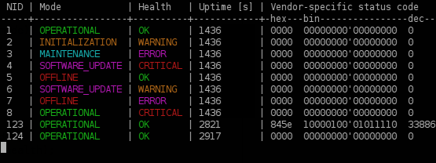
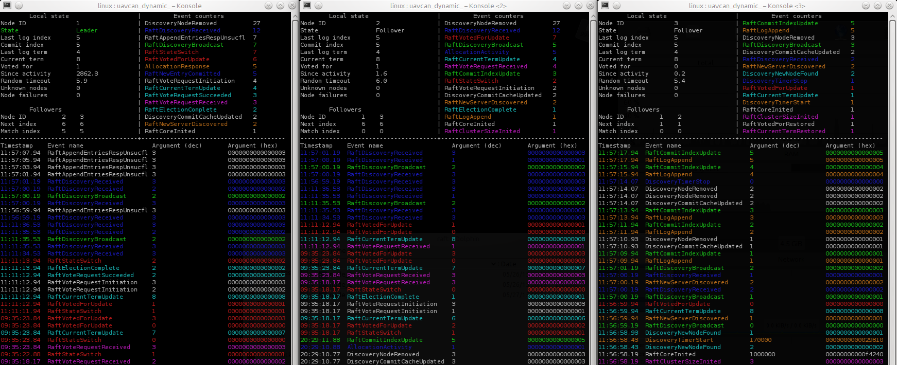

Libuavcan platform driver for Linux
===================================

This document describes the Libuavcan v0 driver for GNU/Linux and shows how to use the library on GNU/Linux.
The libuavcan driver for Linux is a header-only C++11 library that implements a fully functional platform interface
for libuavcan and also adds a few convenient wrappers.
It's built on the following Linux components:

* [SocketCAN](http://en.wikipedia.org/wiki/SocketCAN) -
A generic CAN bus stack for Linux.
* [librt](http://www.lehman.cuny.edu/cgi-bin/man-cgi?librt+3) -
The POSIX.1b Realtime Extensions Library, formerly known as libposix4.
This is used for time measurements and time synchronization support.

Note that the driver will be able to synchronize the system clock with the network time only if the
node application is running with root privileges.
Please read the class documentation at `include/uavcan_linux/clock.hpp` for details.

## Installation

This part describes how to install libuavcan - including the Linux driver - on a Linux machine.

Runtime prerequisites:

* Linux kernel 2.6.33+ (recommended 3.9+)
* librt (available by default in all Linux distributions)

Build prerequisites:

* All runtime prerequisites
* Python 3
* C++11-capable compiler, e.g., GCC 4.8 or newer
* CMake 2.8+

Suggested packages (optional):

* can-utils

Before building, make sure that the libuavcan git repository is cloned properly and all submodules are checked out
correctly.
The git submodules can be checked out with the following command: `git submodule update --init --recursive`.

Build steps:

```sh
cd libuavcan
mkdir build
cd build
cmake ..        # Optionally, set the build type: -DCMAKE_BUILD_TYPE=Release (default is RelWithDebInfo)
make -j4        # This  will invoke the DSDL compiler automatically
sudo make install
```

The following components will be installed into the system:

* Libuavcan headers and the static library.
* The Linux driver for libuavcan (this is a header-only library, so only headers are installed).
* The POSIX driver for libuavcan (this is a header-only library too).
* Generated DSDL headers (installed into the same directory as the libuavcan headers).
* Libuavcan DSDL compiler (Python script `libuavcan_dsdlc`, use `--help` to get usage info).
* Libuavcan DSDL compiler's support library (Python package `libuavcan_dsdl_compiler`).
* CLI tools (see below).

Pyuavcan will not be installed into the system together with the library; you'll need to install it separately.
The installed DSDL compiler will not function unless pyuavcan is installed.

Installation prefix can be overridden via make variable `PREFIX`.
Default installation prefix depends on the Linux distribution;
for example, on Ubuntu the default prefix is `/usr/local/`.

## Using without installation

It is possible to include Libuavcan into another CMake project as a CMake subproject.
In order to do so, extend your `CMakeLists.txt` with the following lines:

```cmake
# Include the Libuavcan CMake subproject
add_subdirectory(
    libuavcan                                       # Path to the Libuavcan repository, modify accordingly
    ${CMAKE_BINARY_DIR}/libuavcan                   # This path can be changed arbitrarily
)

# Add Libuavcan include directories
include_directories(                                # Or use target_include_directories() instead
    libuavcan/libuavcan/include
    libuavcan/libuavcan/include/dsdlc_generated
    libuavcan_linux/include
)

# Link your targets with Libuavcan
target_link_libraries(
    your_target                                     # This is the name of your target
    uavcan
)
```

## Usage

Documentation for each feature is provided in the Doxygen comments in the header files.

Linux applications that use libuavcan need to link the following libraries:

* libuavcan
* librt

### Code example

Please refer to the `apps` directory to find some usage examples.

Refer to the libuavcan tutorials to learn how to add a virtual CAN bus interface for testing on Linux.

### Note on SocketCAN

It is recommended to enable automatic bus-off recovery using the option `restart-ms`, as shown in an example below:

```sh
sudo ip link set can0 up type can bitrate 1000000 sample-point 0.875 restart-ms 100
```

It will ensure reliable operation of the dynamic node ID allocation procedure.
Learn more at <https://www.kernel.org/doc/Documentation/networking/can.txt>.

## CLI tools

Libuavcan driver for Linux also includes a couple of simple CLI applications for network monitoring and control.

### `uavcan_monitor`



This application displays a list of online nodes, their health code, operational mode, and uptime in seconds.
The information is displayed as a continuously updating colorized ASCII table.

Note that this application does not require its own Node ID,
because it runs in passive mode (i.e., it can listen to the bus traffic, but can't transmit).

How to use:

    uavcan_monitor <can_iface_name> [can_iface_name ...]

Example for `can0`:

    uavcan_monitor can0

To exit the application, press **Ctrl**+**C**.

### `uavcan_dynamic_node_id_server`



This application implements a dynamic node ID allocation server. Start without arguments to see usage info.

### `uavcan_nodetool`

This application allows to access basic functions of UAVCAN nodes, such as:

* Read or change remote node configuration parameters via standard services `uavcan.protocol.param.*`.
* Restart a remote node using `uavcan.protocol.RestartNode`.
* Request remote node info, such as:
  * `uavcan.protocol.GetNodeInfo`
  * `uavcan.protocol.GetTransportStats`
* Perform automated enumeration using `uavcan.protocol.EnumerationRequest`.
* Etc.

Usage info can be obtained directly from the application by typing "help" in its internal command line.

How to start:

    uavcan_nodetool <node_id> <can_iface_name> [can_iface_name ...]

Example for `can0` and Node ID 127:

    uavcan_nodetool 127 can0

To exit the application, press **Ctrl**+**C**.

*Consider using the [UAVCAN GUI Tool](https://github.com/UAVCAN/gui_tool) instead -
UAVCAN GUI Tool is a much more feature-complete alternative with graphical user interface.
Besides Linux it also runs on Windows and OSX.*

### `uavcan_add_vcan`

Adds a new virtual CAN interface. Useful for testing.
Execute with `--help` to see usage info.

### `uavcan_add_slcan`

Creates a new CAN interface connected to a specified SLCAN adapter.
SLCAN is a commonly used protocol for tunneling CAN data over a serial port, including USB virtual serial ports.
Execute with `--help` to see usage info.
